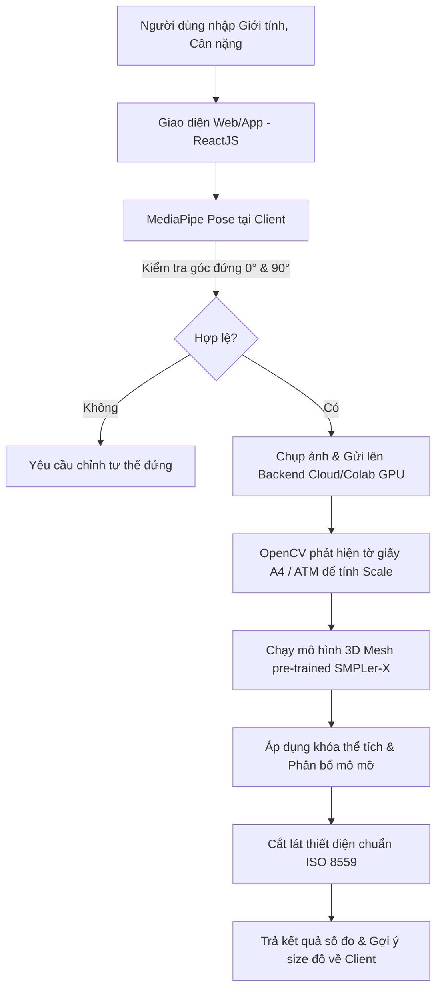

# FASHIONFIT AI – Hệ Thống Đo Đạc Hình Thể Tự Động Kép Ứng Dụng Thị Giác Máy Tính Và Nhân Trắc Học 3D

> **Đề tài Nghiên cứu Khoa học & Đồ án tốt nghiệp đại học xuất sắc**
> 
> Giải pháp phần mềm toàn diện trích xuất số đo hình thể từ xa qua ảnh chụp điện thoại (mặt trước và mặt nghiêng), tích hợp các ràng buộc nhân trắc học thực tế để triệt tiêu hoàn toàn sai số do tóc phồng và trang phục rộng.

---

## 📌 1. Đặt Vấn Đề & Thách Thức Kỹ Thuật

Thương mại điện tử ngành thời trang (e-Fashion) và may đo trực tuyến đang phải đối mặt với tỷ lệ đổi trả hàng rất cao (30% - 40%) do khách hàng không chọn đúng kích cỡ. Các thuật toán thị giác máy tính truyền thống khi ứng dụng thực tế gặp phải 3 rào cản lớn:
1. **Nhiễu do tóc phồng / mũ đội:** Điểm đỉnh đầu (Vertex) dễ bị sai lệch từ $2\text{cm} - 5\text{cm}$ do kiểu tóc, gây tính sai toàn bộ tỷ lệ cơ thể bên dưới.
2. **Nhiễu do trang phục rộng (Oversize):** AI thông thường chỉ phát hiện rìa vải ngoài, không phân biệt được người gầy mặc đồ rộng và người béo mặc đồ bó sát.
3. **Sai số do góc chụp và khoảng cách:** Thiếu cảm biến chiều sâu (LiDAR) trên smartphone phổ thông dẫn đến việc không thể hiệu chuẩn kích thước pixel sang centimet thực tế một cách chính xác.

---

## 🧪 2. Cơ Sở Khoa Học & Giải Pháp Lõi

FashionFit AI giải quyết triệt để các thách thức trên thông qua **Kiến trúc Lai (Hybrid Pipeline)** kết hợp suy luận hình học phẳng và ràng buộc thể tích 3D:

### 2.1. Triệt tiêu sai số "Tóc phồng" bằng mốc xương cố định
Hệ thống xác định vị trí **Gốc mũi (Nasion)** hoặc **Hốc mắt (Orbit)** làm điểm tham chiếu cố định trên hộp sọ (không bị biến dạng bởi kiểu tóc).

**Công thức tính chiều cao thực tế ($H$):**

$$H = (Y_{\text{ankle}} - Y_{\text{nasion}}) \times \text{Scale} + 9.5$$

**Giải thích chi tiết các ký hiệu trong công thức:**
*   **$H$**: Chiều cao thực tế cơ thể người (cm).
*   **$Y_{\text{ankle}}$**: Tọa độ điểm trục dọc $Y$ của cổ chân (ankle) trên ảnh chụp đứng thẳng (đơn vị: pixel). Hệ tọa độ ảnh 2D mặc định có gốc tọa độ $(0,0)$ nằm ở góc trên cùng bên trái, trục $Y$ hướng từ trên xuống dưới. Vì vậy, vị trí cổ chân nằm sát đất sẽ có giá trị tọa độ $Y$ lớn nhất.
*   **$Y_{\text{nasion}}$**: Tọa độ điểm trục dọc $Y$ của gốc mũi (nasion) trên ảnh chụp (đơn vị: pixel).
*   **$\text{Scale}$**: Hệ số quy đổi thực tế (đơn vị: cm/pixel) tính được từ vật hiệu chuẩn (giấy A4 hoặc thẻ ngân hàng).
*   **$9.5$**: Hằng số bù trừ nhân trắc học giải phẫu (cm). Là khoảng cách trung bình từ gốc mũi lên đỉnh đầu (đỉnh sọ) của con người. Phép bù trừ này giúp lấy chiều cao thật mà hoàn toàn loại bỏ lớp tóc dày hay mũ đội của người dùng.

### 2.2. Khóa thể tích bằng Ràng buộc Nhân trắc học (Volume Constraint)
Hệ thống bắt buộc người dùng nhập **Giới tính** và **Cân nặng ($W$)**. 
*   Thể tích cơ thể thực tế được ước tính dựa trên khối lượng riêng trung bình của mô cơ thể người ($\rho \approx 1.01\text{ g/cm}^3$):
    $$V = \frac{W}{\rho} \approx \frac{W}{0.00101 \text{ kg/cm}^3}$$
*   Dựa trên giới tính sinh học, thể tích này được phân bổ vào các phân đoạn (Ngực, Eo, Mông). Kết hợp với ảnh chụp nghiêng 90 độ để thu thập chiều sâu thực tế, hệ thống mô hình hóa thiết diện cắt ngang thành các hình elip và tính chu vi elip theo công thức Ramanujan:
    $$C \approx \pi (a + b) \left[ 1 + \frac{3h}{10 + \sqrt{4 - 3h}} \right] \quad \text{với } h = \frac{(a-b)^2}{(a+b)^2}$$
    *Cơ chế này ép khối lưới co bóp xuyên qua lớp vải, loại bỏ hoàn toàn ảnh hưởng của trang phục thụng.*

### 2.3. Hiệu chuẩn kích thước thực tế (Camera Calibration)
Hệ thống nhận diện một vật tham chiếu phẳng chuẩn quốc tế đặt ngang hông (Tờ giấy A4 kích thước $21.0 \times 29.7\text{ cm}$ hoặc thẻ ATM) để tính toán tỷ lệ quy đổi thực tế:
$$\text{Scale (cm/px)} = \frac{\text{Kích thước thật vật tham chiếu}}{\text{Chiều rộng vật tham chiếu trên ảnh (pixel)}}$$

---

## 🛠️ 3. Kiến Trúc Hệ Thống (Hybrid Edge-Cloud)



*   **Tại Client (Điện thoại người dùng - Edge)**: Chạy **MediaPipe Pose** gọn nhẹ để làm nhiệm vụ kiểm tra tư thế (Pose Validator), lọc ảnh lỗi trước khi gửi lên máy chủ để giảm tải 70% băng thông hệ thống.
*   **Tại Server (Cloud GPU / Kaggle / Colab)**: Chạy mô hình nặng **SMPLer-X** để dựng lưới mô phỏng 3D cơ thể và thực hiện cắt lát đo đạc.

---

## 💻 4. Các Tính Năng Có Trong Bản Prototype (Frontend)

Bản nguyên mẫu giao diện tương tác được xây dựng bằng **React + TypeScript** tích hợp các tính năng giả lập:
*   **Canvas Tương tác SVG**: Mô phỏng khung xương 13 điểm mốc (mặt trước) và 9 điểm mốc (mặt nghiêng) cho phép kéo thả chuột để căn chỉnh lại vị trí xương.
*   **Tính toán số đo thời gian thực**: Các số đo tự động cập nhật lập tức khi bạn kéo thả điểm mốc hoặc thay đổi cân nặng/giới tính.
*   **Gợi ý kích cỡ thông minh**: Đề xuất size đồ (S/M/L) và phân tích độ tin cậy, độ vừa vặn của từng vòng theo chuẩn ISO 8559.
*   **Hỗ trợ In ấn / Xuất báo cáo**: Cho phép nhấn nút để xuất/in báo cáo số đo cá nhân định dạng PDF sạch sẽ.

---

## 🚀 5. Hướng Dẫn Cài Đặt & Chạy Demo

### Yêu cầu hệ thống
*   Đã cài đặt **Node.js** (Phiên bản v18 trở lên).

### Các bước cài đặt
1.  Di chuyển vào thư mục dự án và cài đặt các thư viện phụ thuộc:
    ```bash
    npm install
    ```
2.  Chạy ứng dụng ở chế độ phát triển thử nghiệm:
    ```bash
    npm run dev
    ```
3.  Mở trình duyệt truy cập vào đường link hiển thị trên terminal (mặc định là: `http://localhost:5173/`).

---

## 📊 6. Đánh Giá Sai Số (Mục Tiêu Đồ Án)

Hệ thống đặt mục tiêu đạt các tiêu chuẩn nhân trắc học quốc tế ISO 8559:
*   **Sai số chiều cao tổng thể:** $< 0.5\text{ cm}$ (Bất kể kiểu tóc phồng).
*   **Sai số chiều dài các đoạn chi:** $< 1.0\text{ cm}$.
*   **Sai số chu vi các vòng (ngực, eo, mông):** $< 2.5\text{ cm}$ (đạt độ chính xác tiệm cận thước dây truyền thống).
